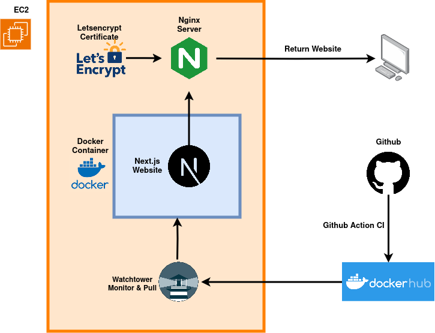

# PCI Website System Structure

## System Structure

The website project consists of three components: The Codebase, Github repo + CI/CD, and the Web Server.

### Codebase

- Webapp Powered by Next.js

### CI / CD

- Github action to check for Next.js build errors
- Docker script to build & push docker image to docker hub

### Server

There are two servers for PCI-website now, one production and one for staging.

__Staging__ ___(beta.policychangeindex.org)___

- Amazon Linux 2023 on AWS EC2

__Production__ ___(policychangeindex.org)___
- Ubuntu server on AWS EC2 instance

Both servers have the same following components:
- Nginx server to handle web requests and reverse proxy
- HTTPS certificate from Let's Encrypt
- Docker service to serve the website docker image
- Watchtower (as a docker image) to periodically pull the latest image from docker hub and deploy

