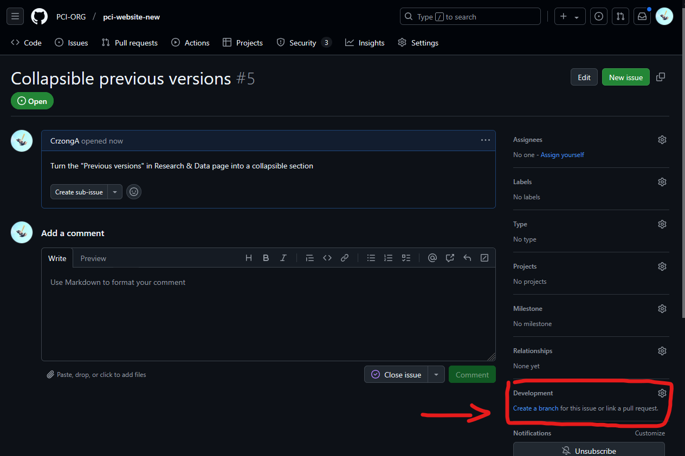
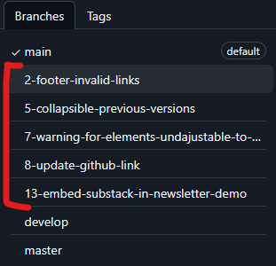
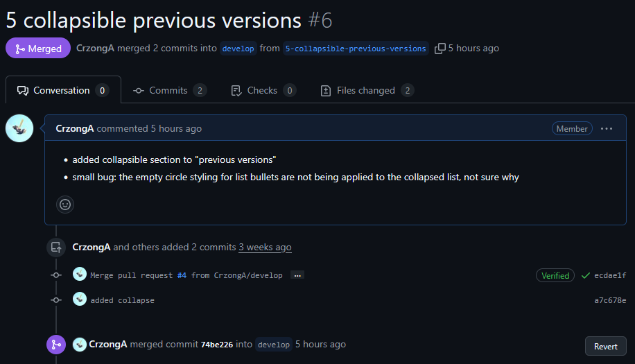

# PCI Website Update Workflow

This document describes the suggested workflow to properly update the PCI website. Following this workflow should guarantee easily traceable cause and effect of actions and code safety enforced via automated build tests.

## Caution

- DO NOT push to main branch directly.

- All side branches must be first merged to `develop` for staging tests before being merged into `main`.

## Story

1. User / Developer discovers a bug in the website. A similar case that would trigger the same workflow is a new feature for the website is being requested.

2. A [github issue](https://github.com/PCI-ORG/pci-website-new/issues) describing the bug discovery or feature request should be created.

3. Developer creates a branch based on this github issue.

    

    The branch name should be something like:

    

4. Developer completes the feature / fixes the bug, and pushes a commit that resolves the related issue.

5. (Optional but recommended) Build the app locally to check for any build errors

6. Developer creates a [pull request](https://github.com/PCI-ORG/pci-website-new/pulls), references the related issue in the comment, and merges the branch into `develop` branch.

    

7. Developer checks the latest github action triggered by step 6 to see if it succeeded, if not continue working on the sub-branch and attempt pull request until the github action succeeds.

8. View the latest beta version on [beta.policychangeindex.org](beta.policychangeindex.org)

    > Note: The website would only reflected the latest commit in `develop` if the build pipeline in github action succeeded.

9. **Important!!** Consult confirmation from the website owners before merging into `main`, via pull request.

10. Create a github release with version tagging.

